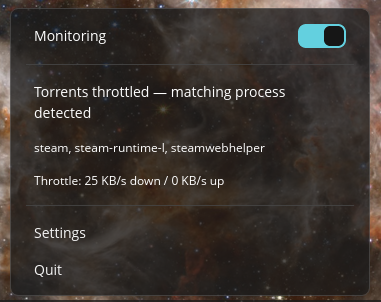
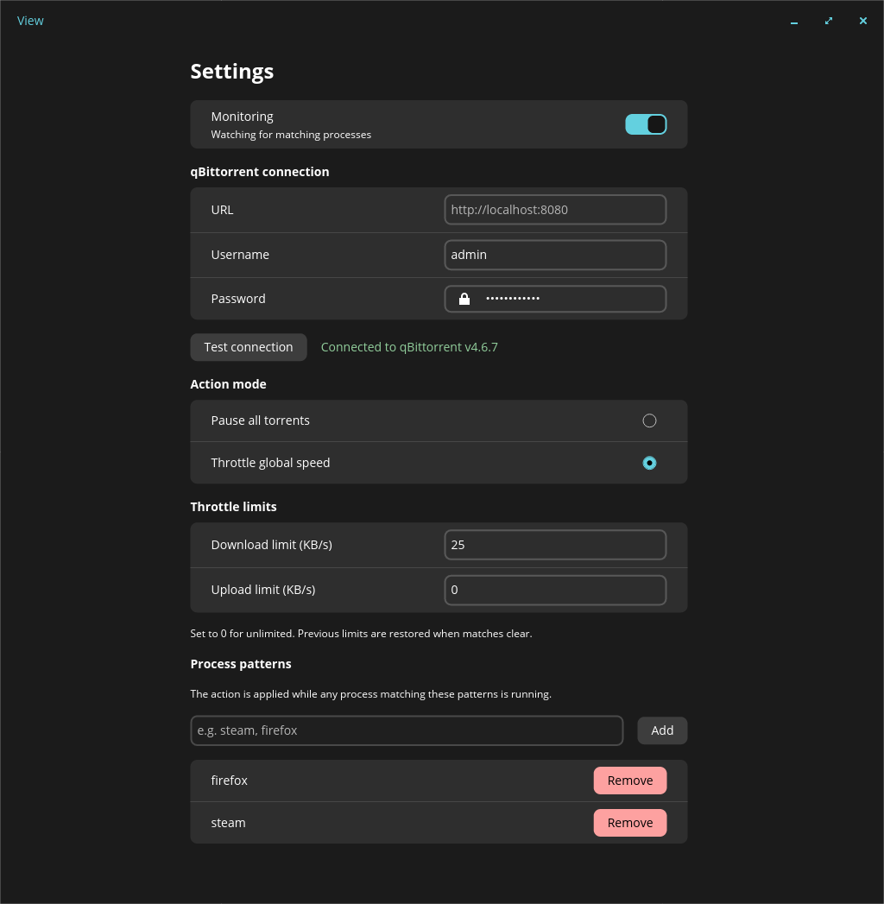

# Torrent Throttle

Torrent Throttle for the COSMIC™ desktop — a panel applet that monitors running processes and automatically pauses or throttles torrent downloads based on configurable process name patterns, so your torrents yield bandwidth to the programs you care about. Currently supports qBittorrent (via its Web API); support for other torrent clients is planned.

COSMIC™ is a trademark of System76. This is a third-party application and is not affiliated with or endorsed by System76.

## Screenshots

| Applet popup | Settings |
| --- | --- |
|  |  |

## Features

- **Process Monitoring**: Scans running processes on a configurable interval for configurable name patterns
- **Auto-Pause**: Pauses all qBittorrent downloads when a matching process is detected
- **Auto-Resume**: Resumes downloads when no matching processes are running
- **Panel Applet**: A native COSMIC panel applet (like Wi-Fi/Bluetooth) whose popup has a real toggle switch for monitoring plus live status and throttle info. The settings window is a separate view launched from the popup
- **COSMIC Native**: Built with libcosmic for native integration with the COSMIC desktop
- **Configurable**: Set qBittorrent API connection details and process patterns through the GUI
- **i18n Ready**: Uses Fluent for internationalization
- **cosmic-config**: Persistent settings managed through COSMIC's configuration system

## Upcoming Features

- **Live Speed Display**: See current upload/download speed from your torrent client directly in the applet
- **Multi-Client Support**: Support for torrent clients beyond qBittorrent

## Use Case

Automatically pause torrent downloads when bandwidth-hungry applications (games, video calls, etc.) are running, and resume when they close.

## Building

```bash
cargo build --release
```

Or using `just`:

```bash
just build-release
```

## Installation

### Flatpak (recommended)

Download the `.flatpak` bundle from the
[latest release](https://github.com/BlakeGardner/cosmic-ext-applet-torrent-throttle/releases/latest)
and install it:

```bash
flatpak install --user cosmic-ext-applet-torrent-throttle-<version>.flatpak
```

Then launch **Torrent Throttle** once (or add the applet via **COSMIC Settings →
Desktop → Panel → Configure panel applets**) to place it on your panel.

### From source

```bash
just install
```

This installs the binary plus two desktop entries: the settings application and
the panel applet (`io.github.BlakeGardner.cosmic-ext-applet-torrent-throttle.Applet`). Launching the
settings application adds the applet to your panel and starts it if it isn't
already running; you can also place it manually via **COSMIC Settings →
Desktop → Panel → Configure panel applets**.

### Uninstalling

`just uninstall` removes the system-installed files. To also wipe the per-user
footprint (running instances, panel entry, dev desktop entry, config and
state), run:

```bash
./scripts/uninstall-local.sh              # full cleanup
./scripts/uninstall-local.sh --keep-config  # keep your settings
```

## Running

The settings window:

```bash
cargo run --release
```

The panel applet (normally launched by the panel itself):

```bash
cargo run --release -- --applet
```

## Distributing via COSMIC Store

The packaging follows the pattern used by applets in the COSMIC Store:

- The AppStream metainfo declares `<provides><id>com.system76.CosmicApplet</id></provides>`,
  which is what places an app in the store's **Applets** section.
- Applets are distributed through the [COSMIC Flatpak repo](https://github.com/pop-os/cosmic-flatpak)
  (not Flathub) — submit a PR adding `app/io.github.BlakeGardner.cosmic-ext-applet-torrent-throttle/` with the
  JSON manifest from `flatpak/` (with `RELEASE_COMMIT` replaced by the release
  commit SHA) plus a generated `cargo-sources.json`
  ([flatpak-cargo-generator](https://github.com/flatpak/flatpak-builder-tools/tree/master/cargo)).
- Notes on the manifest's `finish-args`:
  - `--talk-name=com.system76.CosmicSettingsDaemon.*` — the settings daemon
    hands out per-config objects on child bus names
    (`com.system76.CosmicSettingsDaemon.Config.<id>.V<n>`); without this the
    config watcher gets no change notifications inside the sandbox.
  - `--filesystem=~/.local/state/cosmic/...:create` — cosmic-config writes
    *state* (shared monitor status between applet instances) to
    `$HOME/.local/state/cosmic` under Flatpak, not the sandbox
    `XDG_STATE_HOME`; without this grant every state write silently fails.
  - `--talk-name=org.freedesktop.Flatpak` — host process monitoring via
    `flatpak-spawn --host ps` (sandboxes have their own PID namespace, so
    sysinfo cannot see host processes).
- Sandbox support is built in: when running inside Flatpak, process
  monitoring uses `flatpak-spawn --host ps` (enabled by
  `--talk-name=org.freedesktop.Flatpak`, the same pattern used by other
  applets in the COSMIC Flatpak repo), and cross-instance coordination
  (leader election, quit) uses the Flatpak per-app shared runtime
  directory and cosmic-config state instead of signals.

## Releasing a new version

Everything below must land in a single commit **before** tagging, so the tag,
binary version, and store metadata all agree (v0.1.5 shipped mismatched
because the tag was pushed without the version bump):

1. Bump `version` in `Cargo.toml`.
2. Refresh the lockfile so it records the new version:
   ```bash
   cargo update -p cosmic-ext-applet-torrent-throttle
   ```
3. Add a `<release version="X.Y.Z" date="YYYY-MM-DD">` entry (with a short
   changelog `<description>`) to
   `resources/io.github.BlakeGardner.cosmic-ext-applet-torrent-throttle.metainfo.xml` —
   the COSMIC Store shows these entries as the app's changelog. Validate with:
   ```bash
   appstreamcli validate resources/*.metainfo.xml
   ```
4. Commit, then tag and push:
   ```bash
   git push origin master
   git tag vX.Y.Z && git push origin vX.Y.Z
   ```
   The tag triggers the **Release** workflow (builds the binary and the
   flatpak bundle, creates the GitHub release — the flatpak build also proves
   the manifest still builds offline) and the **Flatpak cargo-sources**
   workflow (uploads a `cargo-sources.json` artifact).
5. Update the COSMIC Flatpak repo — open a PR against
   [pop-os/cosmic-flatpak](https://github.com/pop-os/cosmic-flatpak) that, in
   `app/io.github.BlakeGardner.cosmic-ext-applet-torrent-throttle/`:
   - sets the manifest's `commit` field to the new release commit SHA
     (`git rev-parse vX.Y.Z`), and
   - replaces `cargo-sources.json` with the artifact from the
     **Flatpak cargo-sources** run for the tag (needed whenever `Cargo.lock`
     changed, which is nearly always).

   Users receive the update through the COSMIC Store once that PR is merged —
   the flatpak repo builds only what its manifests pin, it never pulls the
   latest code automatically.

## Configuration

Settings are stored via `cosmic-config` under the app ID `io.github.BlakeGardner.cosmic-ext-applet-torrent-throttle`:

- **qBittorrent URL**: The Web UI address (e.g. `http://localhost:8080`)
- **Username/Password**: qBittorrent Web UI credentials
- **Process Patterns**: List of substrings to match against running process names (case-insensitive)
- **Poll Interval**: How often to scan processes (minimum: 5 seconds)

## Requirements

- COSMIC desktop environment (or libcosmic dependencies)
- qBittorrent with Web UI enabled
- Rust toolchain

## License

GPL-3.0
