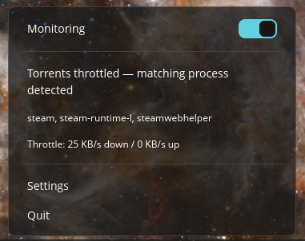
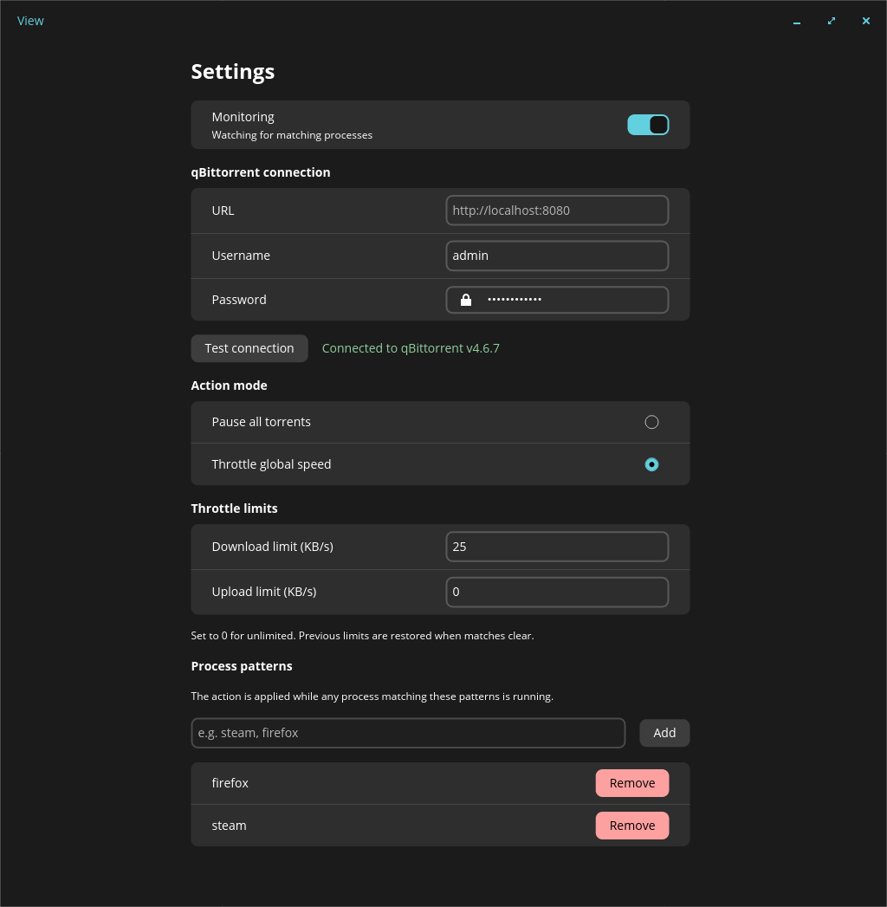

# Torrent Throttle

Torrent Throttle for the COSMIC™ desktop — a panel applet that monitors running processes and automatically pauses or throttles torrent downloads based on configurable process name patterns, so your torrents yield bandwidth to the programs you care about. Supports qBittorrent (via its Web API) and Transmission (via its RPC API).

COSMIC™ is a trademark of System76. This is a third-party application and is not affiliated with or endorsed by System76.

## Screenshots

| Applet popup | Settings |
| --- | --- |
|  |  |

## Features

- **Process Monitoring**: Scans running processes on a configurable interval for configurable name patterns
- **Multi-Client**: Works with qBittorrent (4.x and 5.x) and Transmission
- **Auto-Pause**: Pauses all torrent downloads when a matching process is detected
- **Auto-Resume**: Resumes downloads when no matching processes are running
- **Panel Applet**: A native COSMIC panel applet (like Wi-Fi/Bluetooth) whose popup has a real toggle switch for monitoring plus live status and throttle info. The settings window is a separate view launched from the popup
- **COSMIC Native**: Built with libcosmic for native integration with the COSMIC desktop
- **Configurable**: Set torrent client connection details and process patterns through the GUI
- **i18n Ready**: Uses Fluent for internationalization
- **cosmic-config**: Persistent settings managed through COSMIC's configuration system

## Upcoming Features

- **Live Speed Display**: See current upload/download speed from your torrent client directly in the applet
- **Multi-Client Support**: Support for additional torrent clients (e.g. Deluge)

## Use Case

Automatically pause torrent downloads when bandwidth-hungry applications (games, video calls, etc.) are running, and resume when they close.

## Building

```bash
cargo build --release
```

Or using `just`:

```bash
just build-release
```

## Installation

### Flatpak (recommended)

Download the `.flatpak` bundle from the
[latest release](https://github.com/BlakeGardner/cosmic-ext-applet-torrent-throttle/releases/latest)
and install it:

```bash
flatpak install --user cosmic-ext-applet-torrent-throttle-<version>.flatpak
```

Then launch **Torrent Throttle** once (or add the applet via **COSMIC Settings →
Desktop → Panel → Configure panel applets**) to place it on your panel.

### From source

```bash
just install
```

This installs the binary plus two desktop entries: the settings application and
the panel applet (`io.github.BlakeGardner.cosmic-ext-applet-torrent-throttle.Applet`). Launching the
settings application adds the applet to your panel and starts it if it isn't
already running; you can also place it manually via **COSMIC Settings →
Desktop → Panel → Configure panel applets**.

### Uninstalling

`just uninstall` removes the system-installed files. To also wipe the per-user
footprint (running instances, panel entry, dev desktop entry, config and
state), run:

```bash
./scripts/uninstall-local.sh              # full cleanup
./scripts/uninstall-local.sh --keep-config  # keep your settings
```

## Running

The settings window:

```bash
cargo run --release
```

The panel applet (normally launched by the panel itself):

```bash
cargo run --release -- --applet
```

## Distributing via COSMIC Store

The packaging follows the pattern used by applets in the COSMIC Store:

- The AppStream metainfo declares `<provides><id>com.system76.CosmicApplet</id></provides>`,
  which is what places an app in the store's **Applets** section.
- Applets are distributed through the [COSMIC Flatpak repo](https://github.com/pop-os/cosmic-flatpak)
  (not Flathub) — submit a PR adding `app/io.github.BlakeGardner.cosmic-ext-applet-torrent-throttle/` with the
  pinned JSON manifest and `cargo-sources.json`; each GitHub release attaches
  both files as ready-to-submit assets (generated from the `flatpak/` template
  and [flatpak-cargo-generator](https://github.com/flatpak/flatpak-builder-tools/tree/master/cargo)).
- Notes on the manifest's `finish-args`:
  - `--talk-name=com.system76.CosmicSettingsDaemon.*` — the settings daemon
    hands out per-config objects on child bus names
    (`com.system76.CosmicSettingsDaemon.Config.<id>.V<n>`); without this the
    config watcher gets no change notifications inside the sandbox.
  - `--filesystem=~/.local/state/cosmic/...:create` — cosmic-config writes
    *state* (shared monitor status between applet instances) to
    `$HOME/.local/state/cosmic` under Flatpak, not the sandbox
    `XDG_STATE_HOME`; without this grant every state write silently fails.
  - `--talk-name=org.freedesktop.Flatpak` — host process monitoring via
    `flatpak-spawn --host ps` (sandboxes have their own PID namespace, so
    sysinfo cannot see host processes).
- Sandbox support is built in: when running inside Flatpak, process
  monitoring uses `flatpak-spawn --host ps` (enabled by
  `--talk-name=org.freedesktop.Flatpak`, the same pattern used by other
  applets in the COSMIC Flatpak repo), and cross-instance coordination
  (leader election, quit) uses the Flatpak per-app shared runtime
  directory and cosmic-config state instead of signals.

## Releasing a new version

A release is a dedicated release PR followed by a tag. All version data must
land on `master` **before** tagging, so the tag, binary version, and store
metadata all agree (v0.1.5 and v0.2.1 shipped mismatched because their tags
were pushed without the version bump):

1. Merge all feature / bugfix PRs (including dependency bumps) that should be
   part of the release.
2. On a release branch, bump `version` in `Cargo.toml`.
3. Refresh the lockfile so it records the new version:
   ```bash
   cargo update -p cosmic-ext-applet-torrent-throttle
   ```
4. Add a `<release version="X.Y.Z" date="YYYY-MM-DD">` entry (with a short
   changelog `<description>`) to
   `resources/io.github.BlakeGardner.cosmic-ext-applet-torrent-throttle.metainfo.xml` —
   the COSMIC Store shows these entries as the app's changelog. Validate with:
   ```bash
   appstreamcli validate resources/*.metainfo.xml
   ```
5. Open the release PR with those changes and merge it. Then tag the merge
   commit and push the tag:
   ```bash
   git checkout master && git pull
   git tag vX.Y.Z && git push origin vX.Y.Z
   ```
   The tag triggers the **Release** workflow, which builds the binary and the
   flatpak bundle (proving the manifest still builds offline), creates the
   GitHub release, and attaches the two COSMIC Flatpak submission files as
   release assets: the manifest pinned to the release commit and the matching
   `cargo-sources.json`.
6. Update the COSMIC Flatpak repo — open a PR against
   [pop-os/cosmic-flatpak](https://github.com/pop-os/cosmic-flatpak) that
   replaces both files in
   `app/io.github.BlakeGardner.cosmic-ext-applet-torrent-throttle/` with the
   release assets, e.g. from a cosmic-flatpak checkout:
   ```bash
   gh release download vX.Y.Z \
     --repo BlakeGardner/cosmic-ext-applet-torrent-throttle \
     --pattern 'io.github.BlakeGardner.cosmic-ext-applet-torrent-throttle.json' \
     --pattern 'cargo-sources.json' \
     --clobber --dir app/io.github.BlakeGardner.cosmic-ext-applet-torrent-throttle
   ```

   Users receive the update through the COSMIC Store once that PR is merged —
   the flatpak repo builds only what its manifests pin, it never pulls the
   latest code automatically.

## Configuration

Settings are stored via `cosmic-config` under the app ID `io.github.BlakeGardner.cosmic-ext-applet-torrent-throttle`:

- **Client**: Which torrent client to control (qBittorrent 5.x, qBittorrent 4.x, or Transmission)
- **URL**: The client's web address (e.g. `http://localhost:8080` for qBittorrent, `http://localhost:9091` for Transmission — the `/transmission/rpc` path is appended automatically)
- **Username/Password**: Web UI / RPC credentials. Leave both blank when the client does not require authentication (e.g. qBittorrent's "Bypass authentication for clients on localhost", or Transmission without a remote access password)
- **Process Patterns**: List of substrings to match against running process names (case-insensitive)
- **Poll Interval**: How often to scan processes (minimum: 5 seconds)

## Requirements

- COSMIC desktop environment (or libcosmic dependencies)
- qBittorrent (4.x or 5.x) with Web UI enabled, or Transmission with remote access (RPC) enabled
- Rust toolchain

## License

GPL-3.0
